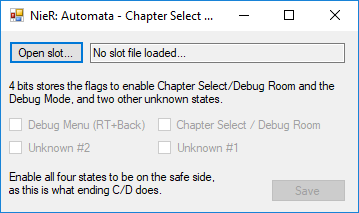

# NieR: Automata - Chapter Select + Debug Mode Unlocker
Allows users to unlock Chapter Select and Debug Menu/Room by editing their save files.

**Make backup of your saves and use at own risk!**



## Usage

1. Download the latest release from the [Releases](https://github.com/Idearum/NieRAutomata_Chapter_Select_Debug_Mode_Unlocker/releases) tab.
2. Run the application and open the appropriate SaveSlot_#.dat file.
3. Tick the boxes for what you want unlocked.
4. Click Save to write the changes to the file.
4. Play the game!

## About

A single byte stores different flags (1 = enabled, 0 = disabled) used for different things. A finished save will have all of the last four flags enabled, meaning 0000 1111.

```
0000 0001
        ^-Unknown flag #1.
0000 0010
       ^- Unknown flag #2.
0000 0100
      ^- Enables Chapter Select and Debug Room
0000 1000
     ^- Enables the Debug Menu (RT + Back)

0010 0000
  ^- Out of scope for this tool, but this flag seems to be set in-between first-time ending C/D gets unlocked. It gets reset on next save. Notification about Resistance Camp Achievement Seller, maybe?
  
```
